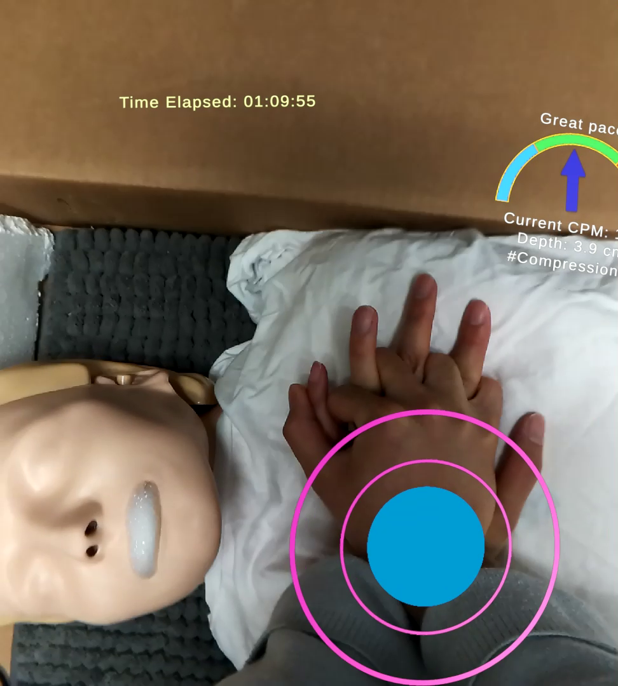

# Situational Awareness Modeling in AR-Guided CPR
This is the official code repository for the paper "Will You Be Aware? Eye Tracking-Based Modeling of Situational Awareness in Augmented Reality", authored by Zhehan Qu, Tianyi Hu, Christian Fronk and Maria Gorlatova. [arxiv](https://arxiv.org/abs/2508.05025)

## Overview

This work seeks to model situational awareness though eye tracking data captured on a Magic Leap 2 device, in an AR app designed for cardiopulmonary resuscitation (CPR) guidance. To evaluate situational awareness, we designed two realistic, unexpected incidents, i.e. the patient bleeding or vomiting during the CPR procedure, to observe the participants' response. Based on their responses we label them with good or poor SA labels and trained a graph neural network that predicts such label at 83% accuracy.

## Video Demostration
Check the video below for how we setup our experiment and how the incidents look in the AR view. (Video link temporarily left blank before final decision)

    

## Code Base Introduction
The code base consists of three main modules: the [gaze extraction and classic ML module](gaze_extraction), the (baseline) [PatchTSMixer module](time_series_modeling) (thanks to George Zerveas et al. for open sourcing their [code](https://github.com/gzerveas/mvts_transformer), from which we built a part of the model training/testing workflow), and the [FixGraphPool module](fix_graph_pool_modeling). The recommanded workflow (and so was our workflow) is to first compile raw collected gaze data through the gaze extraction module, and then run preprocessing code on gaze extraction output to run the different models. 

**Please note that due to IRB requirements we are not able to release the data.** Instead, we provide *sample data files* in [my_data](my_data) to showcase how the raw data and preprocessed data should look like if the code is used properly. Please be aware that all these files are randomly generated and nothing should be implied from the values provided. 

For more details of code usage, please refer to seperate README files in each module. 
- [gaze extraction and classic ML module](gaze_extraction/README.md)
- [PatchTSMixer module](time_series_modeling/README.md)
- [FixGraphPool module](fix_graph_pool_modeling/README.md)

## Citation
Citation temporarily left blank before final decision.

## Acknowledgments
We thank Cliff Merritt, Bradi Granger and Anna Mall for sharing their insights on the study and app design; we thank Prof. David Carlson and Dr. Amy McDonnell for helpful discussions regarding the work and all participants for contributing to the study. This work was supported in part by NSF grants CSR-2312760, CNS-2112562, and IIS-2231975, NSF CAREER Award IIS-2046072, NSF NAIAD Award 2332744, a CISCO Research Award, a Meta Research Award, Defense Advanced Research Projects Agency Young Faculty Award HR0011-24-1-0001, and the Army Research Laboratory under Cooperative Agreement Number W911NF-23-2-0224. The views and conclusions contained in this document are those of the authors and should not be interpreted as representing the official policies, either expressed or implied, of the Defense Advanced Research Projects Agency, the Army Research Laboratory, or the U.S. Government. This paper has been approved for public release; distribution is unlimited. No official endorsement should be inferred. The U.S. Government is authorized to reproduce and distribute reprints for Government purposes notwithstanding any copyright notation herein.