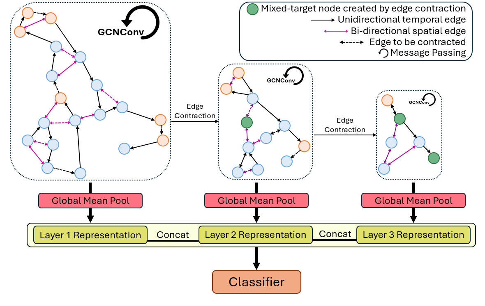

# FixGraphPool Model

This submodule contains the code that trains and evaluates our FixGraphPool model. After completing [gaze extraction](../gaze_extraction/cpr_main_extraction.py), Our [dataset class](dataset/dataset.py) takes in `.json` and `.csv` file pairs and constructs a graph dataset from raw gaze and gaze event data. One can then use the [training code](train.py) to train and evaluate their model on predefined splits. We provide the code that individually trains and evaluates a model on each split. 


## Training Details
To train FixGraphPool, one can run
```
python train.py --split_id X --edge_score_method linear --gnn GCNConv
```
You may change various configurations as shown in [train.py](train.py). To name a few, for the ablation study mentioned in the paper, you can configure
- `--edge_score_no_attr` for not using edge features in edge score computation
- `--bidirectional_temporal_edge` for not using directed temporal edges
- `--only_final_layer` to not use multi-layer feature fusion

You may also play with configurations such as `window_size`, `used_features` on your data. The code writes the results to tensorboard for your review.

## Additional Details
You might have noticed several options that were not included in the paper. These includes:
- `--gnn`: this allows you to choose between different message passing layers. we have provided support for GATv2Conv, GCNConv, GINEConv and TransformerConv, but feel free to implment your own if interested
- `--edge_score_method`: this configures how edge score are computed based on features of nodes and edges. We used a simple linear layer in FixGraphPool, but you may find a different, more complicated method to suit your data better.